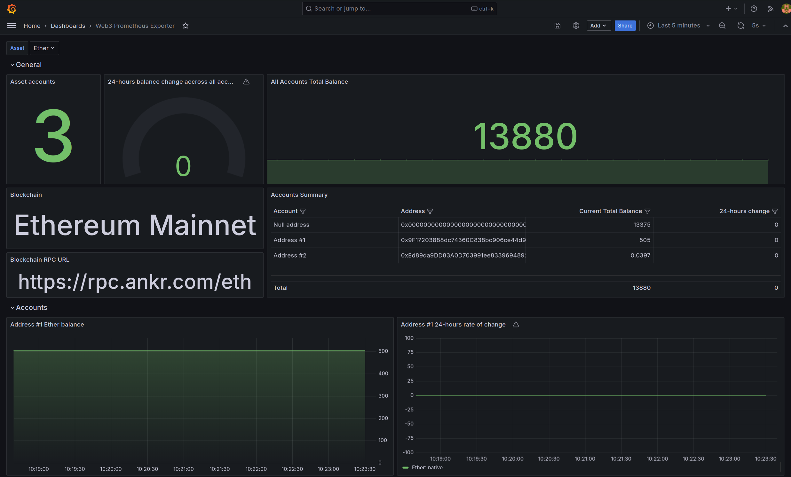

# Web3-Prometheus-Exporter

`Web3-prometheus-exporter` is a Python-based tool that exposes blockchain wallet balance data to a Prometheus-compatible HTTP endpoint. This project is designed to monitor and track balances across various blockchain assets, making it easy to integrate this data into your existing Prometheus and Grafana monitoring setup.



## Features

- **Prometheus-Compatible Exporter**: Expose wallet balance data to Prometheus via an HTTP endpoint.
- **Dockerized Setup**: Quickly deploy the exporter along with Prometheus and Grafana using Docker and Docker Compose.
- **Configurable Assets and Wallets**: Easily specify which wallets and assets to monitor via a simple configuration file.
- **Modular Design**: Extend the exporter with custom modules to support additional asset types without modifying the core codebase.

## Available Modules

The following modules are currently available:

- **`evm_native`**:  
  Fetches the native balance for wallets on Ethereum and other EVM-compatible chains.

- **`cosmos_native`**:  
  Retrieves the native balance for wallets on Cosmos SDK-based chains.

- **`substrate_native`**:  
  Collects the native balance for wallets on Polkadot and other Substrate-based chains.

- **`erc20`**:  
  Retrieves the balance of ERC20 tokens on EVM chains. This module requires an additional asset parameter `extra_parameters.contract_address` to specify the contract address of the ERC20 token.

- **`erc721`**:  
  Fetches the balance of ERC721 tokens (non-fungible tokens) on EVM chains. Similar to `erc20`, this module requires the `extra_parameters.contract_address` to specify the contract address of the ERC721 token.

## Getting Started

### Configuration

Before running the project, you need to create or modify a configuration file that specifies the assets and wallets you want to monitor. 

An example configuration file is provided at [`docker/example-config.yaml`](docker/example-config.yaml). You can use this as a template:

```yaml
# example-config.yaml
assets:                                                   # Array of "assets", each asset is on one blockchain and can have multiple acconuts to check the balances of
- id: ethereum_example                                       # Asset ID - must be unique, but you can put whatever you want.
  blockchain:
    name: "Ethereum Mainnet"                                  # Blockchain name - cosmetic
    rpc_url: "https://rpc.ankr.com/eth"                       # Blockchain RPC URL
  module: "evm_native"                                        # module name - must match one of the file names in the src/targets directory. 
                                                              # For instance, put "evm_native" to use the "evm_native.py" module which can query EVM bockchains
  name: Ether                                                 # Name of the asset - cosmetic
  decimals: 18                                                # Decimals - used to properly calculate assets in the dashboards
  accounts:                                                   # Array of "accounts"
    - address: "0x0000000000000000000000000000000000000000"       # Account address
      name: "Null address"                                        # Name of the account - cosmetic
```

Mount your custom configuration file to the `/app/config.yaml` path in the container.

### Running with Docker Compose

A [`docker-compose.yaml`](docker/) manifest is available for demo purposes.

This will build the project and start the following services:

- **web3-prometheus-exporter**: The exporter service that exposes wallet balances.
- **prometheus**: Pre-configured to scrape data from the exporter.
- **gafana**: Pre-configured to visualize the data with sample dashboards.

You can access Grafana at `http://localhost:3000` (default credentials: `admin/admin`) and prometheus at `http://localhost:9090`.

### Custom Modules

The project uses individual modules located in the [`src/targets`](src/targets/) directory to fetch data for each asset. For example, the [`erc20`](src/targets/erc20.py) module retrieves the balance of a specified ERC20 contract for a given wallet address.

If you need to monitor an asset not supported by the existing modules, you can create a custom module. 

To add a custom module:

1. Create a new Python file implementing the necessary logic. Check out [`src/targets/template-module.py`](src/targets/template-module.py) for more information on how to implement a minimal custom module.
2. Mount your custom module in the `/app/targets/<my_custom_module>.py` path inside the container.
3. Reference the module in the configuration file:

```yaml
assets:
- name: "my_custom_asset"
  module: "my_custom_module"
 #    ...
```
4. If your custom module requires extra pip dependencies from the ones already packaged within the container image, you can change the container's Entrypoint to first install new pip packages before running `python main.py`.

## Contributing

Contributions are welcome! Feel free to submit a pull request or open an issue if you have any suggestions or bug reports.

## License

This project is licensed under the MIT License. See the [LICENSE](LICENSE) file for details.